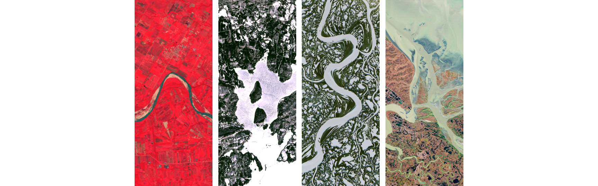
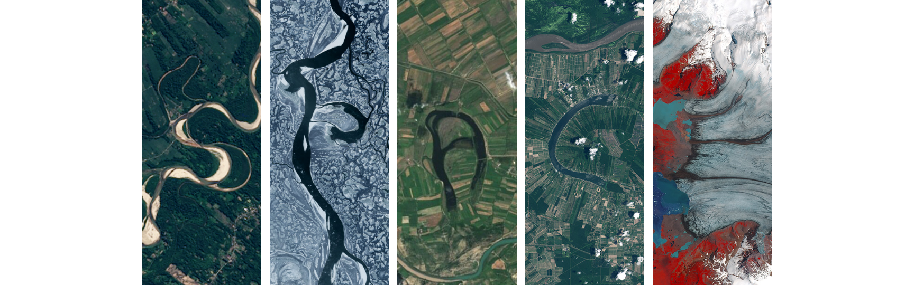
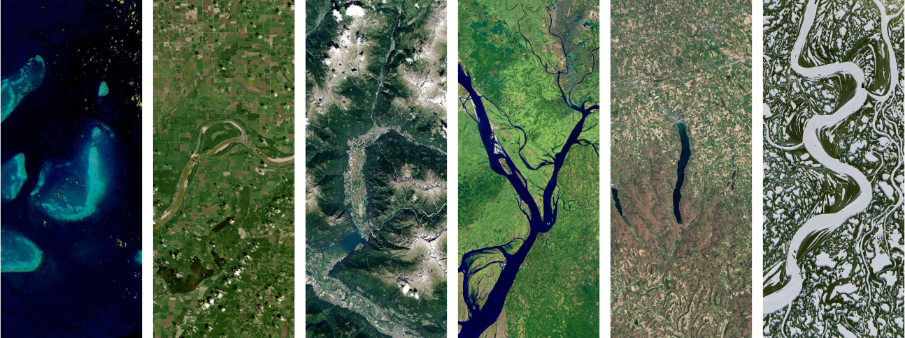

<div align="center">
  <h1>Landsat Name Generator Web Interface</h1>
  <p>A beautiful, bulk-generation wrapper around NASA's "Your Name in Landsat" project.</p>
</div>

<br />

> **Acknowledgment & Disclaimer**
> 
> All satellite imagery and the core letter-composition concept belong entirely to the **[NASA Landsat Project](https://science.nasa.gov/specials/your-name-in-landsat/)**. 
> 
> This tool does not claim to be better than or a replacement for NASA's original interactive website. It was created purely to make generating multiple words **time-efficient** and to provide an easy way to download them with transparent backgrounds. Huge thanks to NASA and the USGS for providing such an incredible public asset!

<br />

## Previews

Here are some examples of what the generated transparent images look like:

<div align="center">
  
  
  
  
</div>

<br />

## Features

- **Bulk Generation**: Enter a list of words, sit back, and let the tool generate them all sequentially.
- **Transparent Backgrounds**: Captures perfectly clean images with alpha-channel transparency, stripping out default white backgrounds.
- **Download as ZIP**: Bundle all your generated satellite images into a single `.zip` file with one click.
- **Premium UI**: Designed with a sleek dark-mode glassmorphism aesthetic using Framer Motion and Tailwind CSS.
- **Serverless / Vercel Ready**: Architected to run on Vercel using `@sparticuz/chromium` and in-memory Base64 processing (circumventing 50MB binary limits and read-only file systems).

## Running Locally

### Prerequisites
- Node.js (v18+)
- npm or pnpm

### Installation

1. Clone the repository
```bash
git clone https://github.com/praveenjadhav1510/landsat-generator.git
cd landsat-generator
```

2. Install dependencies
```bash
npm install
```

3. Run the development server
```bash
npm run dev
```

4. Open [http://localhost:3000](http://localhost:3000) with your browser to see the result.

## Credits
- **Original Source & Imagery:** [NASA Landsat Project](https://science.nasa.gov/specials/your-name-in-landsat/)
- **Developed by:** [Praveen Jadhav](https://praveenjadhav.in)
